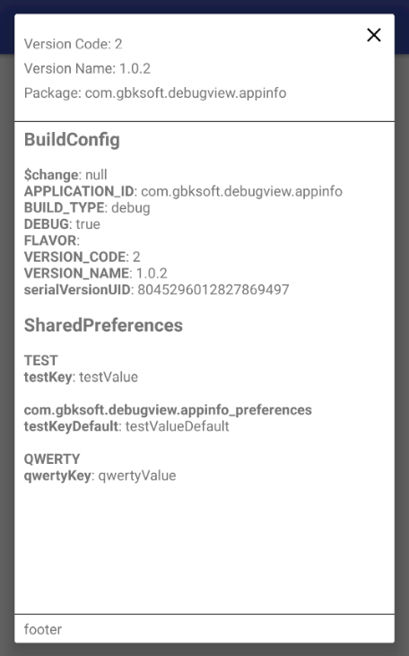
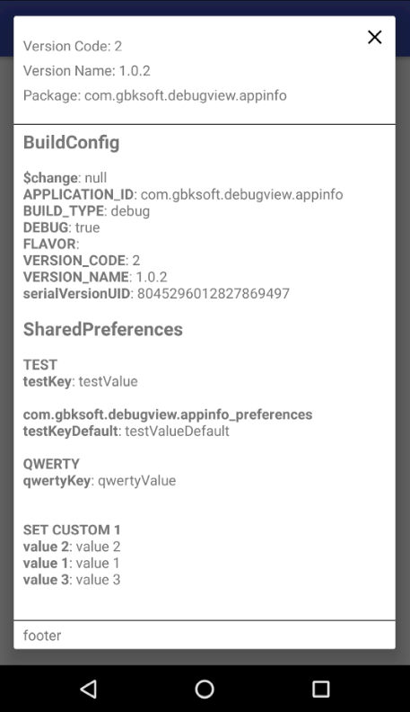
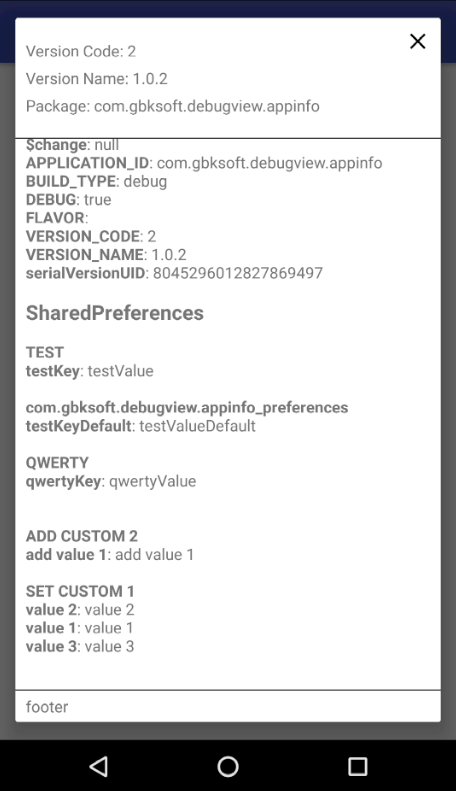

AppInfo
=======

With this library you can easily implement debug view which will show different debug data like contents of BuildConfig and SharedPreferences

## Installation

Add `dependency` into your app level `build.gradle`:

```gradle
dependencies {
    implementation 'com.github.gbksoft:appinfo-android:1.0.0'
}
```
You need to setup AppInfo inside your Application class:

```java
public class MyApplication extends Application {

    @Override
    public void onCreate() {
        super.onCreate();

        setupAppInfo();
    }

    private void setupAppInfo() {
        new AppInfo.Builder(this)
            .isEnabled(true)
            .build();
    }
}
```
You need to pass application context into builder constructor.
Also you can add several parameters to constructor, like:

Add `isShake()` call  to allow showing this debug view via shaking device
```java
new AppInfo.Builder(this).isEnabled(true).isShake().build();
```
You can pass sensitivity parameter to `isShake(4.0f)` method, by default 4.0f  
```java
new AppInfo.Builder(this).isEnabled(true).isShake(4.0f).build();
```
Allow debug view in release build type
```java
new AppInfo.Builder(this).isEnabled(true).build();
```

## How to use:


To manually show debug view you need to call `AppInfo.showAppInfo(this)`, passing  `Activity`  



To set custom data to debug view you need to call method  
`AppInfo.setCustomData(Map<String, Map<String, ?>> customData)`,  



To set custom data to debug view you need to call method   
`AppInfo.addCustomData(Map<String, Map<String, ?>> customData)`,  
